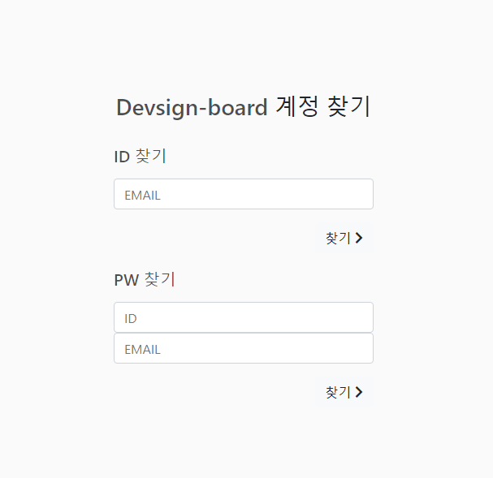

# Project-Devsign-Board

## 개요
- 게시글 및 파일 업로드와 실시간 채팅이 가능한 회원제 게시판입니다.
- 모바일 환경을 고려하여 반응형 레이아웃을 적용했습니다.
- [사이트로 이동](http://hotcat.ddns.net:10001)


### 기술 스택
- Apache 2.4
- PHP 7.4
- mariaDB 10.3
- Express.js

### 라이브러리
- bootstrap 4.3
- jquery 3.4
- PHPMailer 6.1
- Soekct&#46;io

### 플러그인
- Datatables
- TinyMCE

<br>
<br>

## 서버 구조

</img>

<br>


## 구현한 기능
1. [회원가입 및 이메일 인증](#회원가입-및-이메일-인증)
1. [메일을 통한 회원 정보 찾기 및 비밀번호 초기화](#메일을-통한-회원-정보-찾기-및-비밀번호-초기화)
1. [게시글 작성](#게시글-작성)
1. [파일 업로드 및 다운로드](#파일-업로드-및-다운로드)
1. [댓글 작성](#댓글-작성)
1. [소켓 통신을 이용한 실시간 채팅](#소켓-통신을-이용한-실시간-채팅)
1. [세션 공유](#세션-공유)


<br>

## 회원가입 및 이메일 인증

- 회원가입 시 ajax를 사용하여 아이디 또는 이메일 중복 체크를 진행합니다.
- 회원 가입 시 입력한 이메일로 메일을 보내 링크를 클릭하여 인증을 진행하도록 했습니다.
- 인증 키를 생성하여 링크로 전송합니다.


<br>

## 메일을 통한 회원 정보 찾기 및 비밀번호 초기화

- 메일 전송은 PHPMailer와 naver SMTP 서버를 활용했습니다.
- 분실한 ID 또는 비밀번호를 이메일을 통해 찾습니다.
- ID를 찾는 경우에는 등록된 이메일로 ID를 전송합니다.
- 비밀번호를 분실한 경우에는 ID와 이메일을 입력하면 인증 키를 생성하여 DB에 저장한 후, 등록된 이메일로 인증 키를 포함한 링크를 전송합니다.
  - 링크를 전송한 후 로그인에 성공하게 되면, 생성한 인증 키를 삭제합니다.
  - 링크를 클릭하여 비밀번호를 변경하게 되면 생성한 인증 키를 삭제합니다.

&emsp;<details>
&emsp;<summary>스크린샷</summary>
&emsp;<div markdown="1">

&emsp;</img>
&emsp;</img>
&emsp;</img>

</div>
</details>


<br>

## 게시글 작성

- 게시글은 로그인을 한 상태에서만 작성할 수 있습니다.
- editor는 TinyMCE 플러그인을 사용했습니다.
- 본인의 게시글을 수정 및 삭제할 수 있습니다.


&emsp;<details>
&emsp;<summary>스크린샷</summary>
&emsp;<div markdown="1">

&emsp;</img>

</div>
</details>

<br>

## 파일 업로드 및 다운로드

- 게시글 작성 시 파일을 첨부할 수 있습니다.
- 게시글 수정 시 업로드 된 파일의 목록을 수정하거나 추가 업로드 할 수 있습니다.
- drag & drop을 통해 파일을 업로드 할 수 있습니다.
<br>

&emsp;<details>
&emsp;<summary>스크린샷</summary>
&emsp;<div markdown="1">

&emsp;</img>
&emsp;</img>

</div>
</details>

<br>

<details>
<summary>게시글 및 파일 업로드 코드</summary>
<div markdown="1">

```php
<?php 
require_once $_SERVER['DOCUMENT_ROOT'] . '/errors.php';
require_once $_SERVER['DOCUMENT_ROOT'] . '/db.class.php';
require_once $_SERVER['DOCUMENT_ROOT'] . '/declared.php';

if (session_status() == PHP_SESSION_NONE) {
    session_start();
}

DB::connect();

if($_SERVER["REQUEST_METHOD"] == "POST"){
    if(isset($_POST["subject"]) && isset($_SESSION["id"])){
        $id = null;
        
        $query = "INSERT INTO board (user_id, user_name, subject, contents, reg_date, hits) 
        VALUES (:user_id, COALESCE(DEFAULT(user_name), :user_name), :subject, :contents, :reg_date, DEFAULT(hits))";
        $params = array(
            ":user_id" => $_SESSION["id"],
            ":user_name" => $_SESSION["nickname"],
            ":subject" => $_POST["subject"],
            ":contents" => htmlspecialchars($_POST['contents'], ENT_QUOTES),
            ":reg_date" => date("Y-m-d H:i:s")
        );
        DB::query2($query, $params);
        $id = DB::lastInsertId();
        
        // 파일 첨부했는지 확인
        if(is_uploaded_file($_FILES["files"]["tmp_name"][0])){
            ErrorManager::write_log(implode($_FILES));
            $allowDataType = array(
                'jpg', 'png', 'jpeg', 'txt'
            );
            $uploadOk = array_fill(0, 9, true);
            
            for($i = 0; $i < count($_FILES["files"]["name"]); $i++){
                //파일 크기 검사
                if($_FILES["files"]["name"][$i] > 500000){
                    $uploadOk[$i] = false;
                    continue;
                }
                
                //파일 확장자 검사
                $target_file = DB::getFilePath() . basename($_FILES["files"]["name"][$i]);
                $fileType = strtolower(pathinfo($target_file,PATHINFO_EXTENSION));
                
                $isAllowType = false;
                foreach($allowDataType as $type){
                    if($type == $fileType){
                        $isAllowType = true;
                        break;
                    }
                }
                if($isAllowType == false){
                    $uploadOk[$i] = false;
                }
            }
            
            $query = "INSERT INTO table_attach (file_id, board_id, file_name_origin, file_name_save) 
            VALUES (:file_id, :board_id, :file_name_origin, :file_name_save)";
            
            //파일 업로드 및 db에 매핑
            for($i = 0, $cnt = 0; $i < count($_FILES["files"]["name"]); $i++){
                if($cnt > 10){
                    ErrorManager::alert("파일은 10개까지만 업로드 할 수 있습니다.");
                    break;
                }
                if($uploadOk[$i] == true){
                    $file_name_origin = $_FILES["files"]["name"][$i];
                    $file_name_save = md5(microtime()).".".$fileType;
                    $fileType = strtolower(pathinfo($file_name_origin,PATHINFO_EXTENSION));
                    $target_file = DB::getFilePath() . $file_name_save;
                    
                    $params = array(
                        ":file_id" => md5(uniqid(rand(), true)),
                        ":board_id" => $id,
                        ":file_name_origin" => $file_name_origin,
                        ":file_name_save" => $file_name_save
                    );
                    
                    if (move_uploaded_file($_FILES["files"]["tmp_name"][$i], $target_file)) {                            
                        ErrorManager::write_log("The file ". basename($file_name_origin). " has been uploaded.");
                        DB::query2($query, $params);
                        $cnt++;
                    } else {
                        ErrorManager::alert("파일 업로드 실패 {$file_name_origin}");
                        ErrorManager::write_log("Sorry, there was an ErrorManager uploading your file.");
                    }
                }
            }
        }
    }
}
?>
```
</div>
</details>

&emsp;<details>
&emsp;<summary>게시글 및 파일 수정 코드</summary>
&emsp;<div markdown="1">

```php
<?php
require_once $_SERVER['DOCUMENT_ROOT'] . "/declared.php";
require_once $_SERVER['DOCUMENT_ROOT'] . "/db.class.php";
require_once $_SERVER['DOCUMENT_ROOT'] . '/errors.php';

if (session_status() == PHP_SESSION_NONE) {
    session_start();
}

if (isset($_POST["board_id"])) {
    DB::connect();
    $rows = DB::query2(
        "SELECT user_id FROM board WHERE board_id = :board_id",
        array(":board_id" => $_POST["board_id"])
    );

    if ($rows["0"]["user_id"] == $_SESSION["id"]) {
        DB::query2(
            "UPDATE board SET subject = :subject, contents = :contents WHERE board_id = :board_id",
            array(
                ":subject" => $_POST["subject"],
                ":contents" => htmlspecialchars($_POST['contents'], ENT_QUOTES),
                ":board_id" => $_POST["board_id"]
            )
        );

        // 파일 삭제
        if ($_POST["removeFiles"][0] != '') {
            $removeFileList = $_POST["removeFiles"]; // 삭제할 파일 ID들

            foreach ($removeFileList as $file) {
                $fileName = DB::query2(
                    "SELECT file_name_save FROM table_attach WHERE board_id = :board_id AND file_id = :file_id",
                    array(":board_id" => $_POST["board_id"],
                    ":file_id" => $file)
                );
                unlink(DB::getFilePath() . $fileName[0]["file_name_save"]);
                DB::query2(
                    "DELETE FROM table_attach WHERE board_id = :board_id AND file_id = :file_id",
                    array(":board_id" => $_POST["board_id"],
                    ":file_id" => $file)
                );
            }
        }

        // 파일 첨부했는지 확인
        if (is_uploaded_file($_FILES["files"]["tmp_name"][0])) {
            $allowDataType = array(
                'jpg', 'png', 'jpeg', 'txt'
            );
            $uploadOk = array_fill(0, 9, true);

            for ($i = 0; $i < count($_FILES["files"]["name"]); $i++) {
                //파일 크기 검사
                if ($_FILES["files"]["name"][$i] > 500000) {
                    $uploadOk[$i] = false;
                    continue;
                }

                //파일 확장자 검사
                $target_file = DB::getFilePath() . basename($_FILES["files"]["name"][$i]);
                $fileType = strtolower(pathinfo($target_file, PATHINFO_EXTENSION));

                $isAllowType = false;
                foreach ($allowDataType as $type) {
                    if ($type == $fileType) {
                        $isAllowType = true;
                        break;
                    }
                }
                if ($isAllowType == false) {
                    $uploadOk[$i] = false;
                }
            }

            $query = "INSERT INTO table_attach (file_id, board_id, file_name_origin, file_name_save) 
        VALUES (:file_id, :board_id, :file_name_origin, :file_name_save)";

            //파일 업로드 및 db에 매핑
            for ($i = 0, $cnt = 0; $i < count($_FILES["files"]["name"]); $i++) {
                if ($cnt > 10) {
                    ErrorManager::alert("파일은 10개까지만 업로드 할 수 있습니다.");
                    break;
                }
                if ($uploadOk[$i] == true) {
                    $file_name_origin = $_FILES["files"]["name"][$i];
                    $file_name_save = md5(microtime()) . "." . $fileType;
                    $fileType = strtolower(pathinfo($file_name_origin, PATHINFO_EXTENSION));
                    $target_file = DB::getFilePath() . $file_name_save;

                    $params = array(
                        ":file_id" => md5(uniqid(rand(), true)),
                        ":board_id" => $_POST["board_id"],
                        ":file_name_origin" => $file_name_origin,
                        ":file_name_save" => $file_name_save
                    );

                    if (move_uploaded_file($_FILES["files"]["tmp_name"][$i], $target_file)) {
                        ErrorManager::write_log("The file " . basename($file_name_origin) . " has been uploaded.");
                        DB::query2($query, $params);
                        $cnt++;
                    } else {
                        ErrorManager::alert("파일 업로드 실패 {$file_name_origin}");
                        ErrorManager::write_log("Sorry, there was an ErrorManager uploading your file.");
                    }
                }
            }
        }
    }
}
```
</div>
</details>


<br>


## 댓글 작성

- 로그인 상태일 때 게시글에 댓글을 작성 할 수 있습니다.
- 댓글 더보기나 댓글 수정 및 삭제를 구현했습니다.
- 글을 보고 있을 경우 새로 추가되는 댓글을 볼 수 있습니다.

&emsp;<details>
&emsp;<summary>스크린샷</summary>
&emsp;<div markdown="1">

&emsp;</img>

</div>
</details>

<br>


## 소켓 통신을 이용한 실시간 채팅

- node.js의 express 프레임워크와 soekct.io를 이용하여 소켓 통신을 구현했습니다.
- 실시간 채팅은 로그인 상태에서만 가능합니다. 로그인 상태를 확인하기 위해 php 세션을 공유할 수 있게 구현했습니다.

&emsp;<details>
&emsp;<summary>스크린샷</summary>
&emsp;<div markdown="1">

&emsp;</img>
&emsp;</img>

</div>
</details>

<br>


## 세션 공유

- chat server에서 로그인 상태를 확인하기 위해서는 php의 세션을 조회해야 합니다. 이를 구현하기 위해 세션을 DB에 저장하여 관리했습니다.

&emsp;<details>
&emsp;<summary>세션 관리 코드</summary>
&emsp;<div markdown="1">

```php
<?php
require_once('db.class.php');
require_once('errors.php');

$save_path = session_save_path();
$SESS_LIFE = 60 * 60 * 24;

// DB에 접속
function sess_open($savePath, $session_name)
{	
	try {
		DB::connectSession();
	} catch (PDOException $e) {
		// DB 연결 실패
		return false;
	}
	return true;
}


function sess_close()
{
	return true;
}


// 저장된 세션값을 DB에서 가져온다.
// 값 있으면 sess_destroy
// 없으면 sess_write
function sess_read($key)
{

	// 세션이 만료되지 않았다면 가져온다.
	$sess_result = DB::s_query2("SELECT session_value, user_ip, user_id FROM sessions WHERE session_key = :sesskey AND session_expiry > :expiry", array(":sesskey" => $key, ":expiry" => time()));

	// 읽을 데이터 없을 때
	$sess_value = $sess_result[0]['session_value'];
	$user_ip = $sess_result[0]['user_ip'];
	
	if ($sess_value == '') {
		if($user_ip == '-1'){
			ErrorManager::alert('중복 로그인 방지');
		}
		return ''; // 세션 새로 생성
	} else {
		return stripslashes($sess_value);
	}
}

// session_register()를 처리해준다
function sess_write($key, $val)
{
	global $SESS_LIFE;

	// 현재시간에 세션지속시간을 더해준다
	$expiry = time() + $SESS_LIFE;
	$value = addslashes($val);
	$user_id = '';
	if(strlen($val) > 0){
		$val_split = explode(';', $val);
		$id_split = explode(':', $val_split[0]);
		$user_id = trim($id_split[2], '"');
	}

	try{
		DB::s_query2("UPDATE sessions SET session_value = :sessvalue, user_ip = :overlap_code WHERE session_key <> :sesskey AND user_id = :user_id", array(':sessvalue' => '', ':overlap_code' => '-1', ':sesskey' => $key, ':user_id' => $user_id));
		
		DB::s_query2(
			"REPLACE INTO sessions SET session_key = :sesskey, session_value = :sessvalue, session_expiry = :expiry, user_id = :user_id, user_ip = :user_ip",
			array(
				':sesskey' => $key,
				':sessvalue' => $value,
				':expiry' => $expiry,
				':user_id' => $user_id,
				':user_ip' => (strlen($value) == 0) ? '' : $_SERVER['REMOTE_ADDR']
			)
		);
	}catch(PDOException $e){
		return false;
	}
	
	return true;
}


// session_unregister()를 처리해준다.
function sess_destroy($key)
{

	try {
		DB::s_query2("DELETE FROM sessions WHERE session_key = :sesskey", array(':sesskey' => $key));
	} catch (PDOException $e) {
		return false;
	}

	$file = "$save_path/sess_$key";
	if (file_exists($file))
	{
		unlink($file);
	}

	return true;
}


// 만료된 세션을 지움
function sess_gc($maxlifetime)
{

	foreach (glob("$save_path/sess_*") as $file) {
		$key = explode('_', $file)[1];
		if (filemtime($file) + $SESS_LIFE < time()) {
			DB::s_query2("DELETE FROM sessions WHERE session_key = :sesskey", array(':sesskey' => $key));
			if(file_exists($file)){
				unlink($file);
			}
		}
	}
	return true;
}

if ( !isset($_SESSION) ){
	session_set_save_handler("sess_open", "sess_close", "sess_read", "sess_write", "sess_destroy", "sess_gc");
}
register_shutdown_function('session_write_close');
@session_start();
```
</div>
</details>

&emsp;<details>
&emsp;<summary>세션 확인 코드</summary>
&emsp;<div markdown="1">

```js
app.get('/', (req, res) => {
    let _url = req.url;
    sessid = url
        .parse(_url, true)
        .query['sessid'];

    if (sessid !== undefined) {
        // db에 저장된 PHP세션 값이 유효할 때 express 세션 생성 동기 실행 코드
        var result;
        (async () => {
            result = await db.run(sessid);
        })
            .then(() => {
                if (result !== '') { // PHP세션 값 살아있으면
                    var sess = req.session;
                    // php session value 파싱 후 express 세션 값에 추가
                    result
                        .split(';')
                        .forEach(fields => {
                            if (fields == '') 
                                return;
                            var col = fields.split(':');
                            var key = '_' + col[0].split('|')[0];
                            var is_null = col[0].split('|')[1];

                            sess[key] = (is_null == 'N') ? '' : col[2].split('"')[1];
                        });

                    user_id = sess['_id'];
                    sess.save();

                    client.hset(req.sessionID, 'id', user_id);
                    global.sessionID = req.sessionID;

                    res.redirect('/chat-list');

                } else {
                    res
                        .status(401)
                        .send('<script type="text/javascript">alert("잘못된 세션입니다.");</script>');
                    res.end();
                }
            })
            .catch(() => {
                console.log(result);
                res
                    .status(401)
                    .send('<script type="text/javascript">alert("Error!");</script>');
                res.end();
            });
    } else {
        res
            .status(401)
            .send('<script type="text/javascript">alert("잘못된 접근입니다.");</script>');
        res.end();
    }
});
```

```js
let connection = mysql.createConnection({
    host: this.conf.host, // 호스트 주소
    user: this.conf.user, // mysql user
    password: this.conf.password, // mysql password
    database: this.conf.database // mysql 데이터베이스
});
connection.connect();

return new Promise(function(res, rej) {
    connection.query(`SELECT session_value FROM sessions WHERE session_key = '${sessid}';`, function(err, result, fields){
        if (err) {
            rej(err);
            throw err;
        }
        if(result.length == 1){
            res(result[0]['session_value'].replace(/\\(.)/mg, "$1"));
        }else{
            res('');
        }
    });
});
```
</div>
</details>
